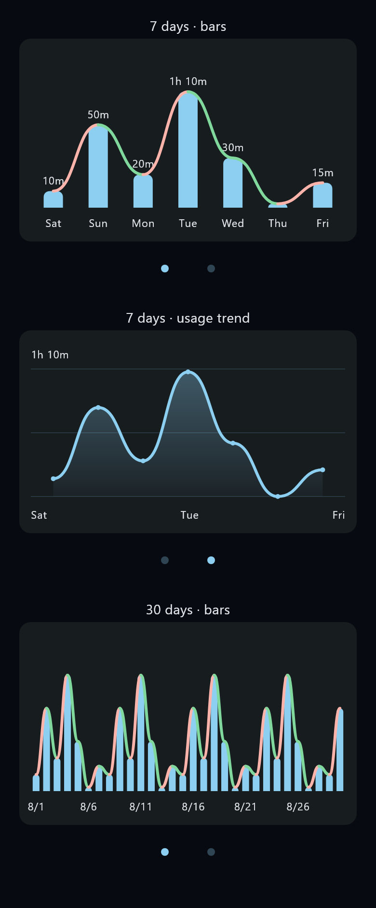

# App-detail charts

Open an app's usage details and swipe left over its bar chart to see a smooth
area chart for the same period. Swipe right to return, or tap either of the two
dots. The filled dot identifies the current chart; the other remains partly
transparent. FocusTrace remembers the selected chart across detail screens and
app launches using the existing local SQLite settings store.

Both charts support 7 days, 2 weeks, 30 days, and 12 monthly totals. The bar chart
retains its usage columns and increase/decrease colors, with smooth curves over
the columns. Longer periods now fit the chart width, with fewer printed date
labels so that horizontal gestures always switch chart pages. Long-press or
hover over a point/column for its date and duration; those values are also
available to screen readers.

The preview below was rendered from the Flutter widgets with **sample data**;
it is not a recording of a user's usage or a physical-device screenshot.

## Implementation and verification

- [Chart widgets](../lib/src/presentation/widgets/usage_details_charts.dart) own
  rendering, gestures, dot accessibility, and tooltips. The curves stay within
  neighboring values instead of implying an overshoot.
- The [ViewModel](../lib/src/presentation/view_models/app_usage_details_view_model.dart)
  owns chart selection and coordinates persistence through the existing settings
  repository. Delayed period loads cannot overwrite newer selections.
- [Widget tests](../test/usage_details_charts_test.dart) exercise swipes and dot
  navigation across every period, initial restoration, and zero-usage rendering.
  [State tests](../test/app_usage_details_view_model_test.dart) cover restored
  preferences, invalid settings, failed writes, rapid selection, and stale loads.
  The [app-flow test](../test/widget_test.dart) checks restoration after reopening
  the actual details route.
- Local verification: 93 Flutter tests passed, static analysis and formatting
  passed, and `flutter build apk --debug --no-pub` produced the debug APK.

Implements [issue #31](https://github.com/sneri12pic/FocusTrace/issues/31).
